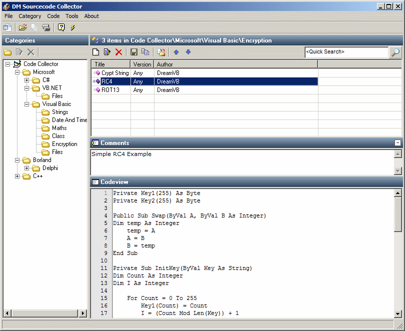



## DM VBCode Collector V1\.2a Update

### Description

Hi this is a little VB Code Collector I made for my self to store all my codes, You can Add, Rename and Delete Categories, Add, Edit and Delete Code examples, You can also compact the database, New Update include a quick serach of cocdes and now codes can be stored in to sub Categories, hope you like the update
 
### More Info
 

             |
---                |---
**Submitted On**   |2009-02-15 19:12:12
**By**             |[dreamvb](https://github.com/Planet-Source-Code/PSCIndex/blob/master/ByAuthor/dreamvb.md)
**Level**          |Beginner
**User Rating**    |5.0 (75 globes from 15 users)
**Compatibility**  |VB 5\.0, VB 6\.0
**Category**       |[Databases/ Data Access/ DAO/ ADO](https://github.com/Planet-Source-Code/PSCIndex/blob/master/ByCategory/databases-data-access-dao-ado__1-6.md)
**World**          |[Visual Basic](https://github.com/Planet-Source-Code/PSCIndex/blob/master/ByWorld/visual-basic.md)
**Archive File**   |[DM\_VBCode\_2147783262009\.zip](https://github.com/Planet-Source-Code/dreamvb-dm-vbcode-collector-v1-2a-update__1-71644/archive/master.zip)

